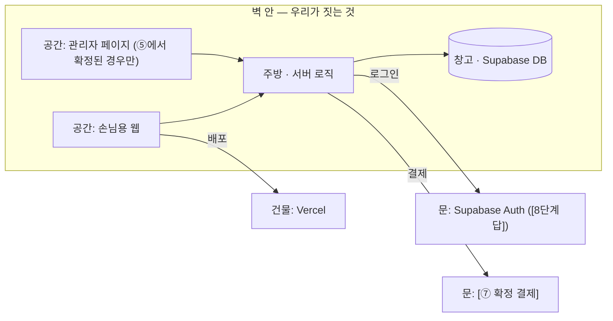

# blueprint 산출물 템플릿 (7종 + plan.md)

> 아래 골격을 그대로 쓰되, 인터뷰 답으로 채운다. 답 안 받은 칸은 지어내지 말고 `[미정]`.
> 이모지 금지. 개발용어 첫 등장 시 괄호로 한 줄 풀이.

---

## 01-prd.md

```markdown
# PRD — [서비스명]
> 작성일: [날짜] · blueprint 인터뷰 기반 · 상태: 초안/확정

## 1. 개요
- 한 줄 정의: [1-1]
- 레퍼런스: [1-2] (다른 점: [1-C2])
- 배경·동기: [1-3]
- 성공 기준: [1-4]

## 2. 문제·타겟
- 페르소나: [2-1]
- 문제 장면: [2-2]
- 현재 대안과 한계: [2-3] / [2-4]
- 사용자 vs 결제자: [2-5] · 규모 가늠: [2-6]

## 3. 기능 (MVP)
| 순위 | 기능 | 완료 기준 |
|---|---|---|
| 1 | [3-6 1위] | [3-3] |
| 2 | ... | ... |
| 3 | ... | ... |

### 완성 제품 로드맵 (꿈은 보존, 층으로 쌓는다)
- **다음 버전** (감당 가능, 이번엔 안 함): [3-4 목록]
- **완성 제품** (최종 그림): [사용자가 말한 큰 그림 — 예: B2B2C 플랫폼화, AI 맞춤 추천]
- **감당선 밖** (Supabase·Vercel·Railway·Cloudflare 급으론 불가): [3-1 판정표의 감당선 밖 항목 + 대체안 + 두 길: 더 공부해서 직접(배울 키워드) / 전문가 외주 — 선택은 나중에 해도 된다]

### Out of Scope (절대 안 함)
- [3-5 목록]

## 4. 유저 플로우
→ 03-userflow.md

## 5. 화면 정의
→ 02-spec.md · 04-wireframe.html

## 6. 데이터 모델
→ 05-db.md

## 7. 외부 연동
**기본 스택**: Supabase(저장·로그인) · Vercel(배포) [· Cloudflare — 포함 시 사유 명시: 도메인 DNS / 이미지 R2. 미포함 판정이면 이 항목 자체를 지운다]

| 기능 | 플랫폼 | 발급처 | .env 키 |
|---|---|---|---|
| [로그인] | [Supabase Auth] | supabase.com | SUPABASE_URL 외 |

## 8. 지킬 조건 (개발자 말로 '비기능' — 앱이 하는 일이 아니라 지켜야 할 규칙)
- 권한 등급: [8-1]
- 관리자: [8-2]
- 최우선 보호 데이터: [8-3]
- 실패 시 안내: [8-4] · 외부 장애 시: [8-5]
- 문의 채널: [8-6] · 백업: [8-7]
```

---

## 02-spec.md (기능명세서)

```markdown
# 기능명세서 — [서비스명]

## 화면: [화면명] ([이 화면의 목적 한 가지])
| No | 구분 | 기능 | 설명 | 우선순위 |
|---|---|---|---|---|
| 1 | 표시 | [로고] | 상단 고정 | MVP |
| 2 | 입력 | [제목 입력칸] | 필수 · 30자 · 비면 "[오류 문구]" | MVP |
| 3 | 동작 | [생성 버튼] | 누르면 → [목적지 화면] | MVP |
| 4 | 표시 | 빈 상태 | 데이터 0건이면 "[안내 문구]" + [버튼] | MVP |
(화면마다 반복. 구분 = 표시/입력/동작/목록. 우선순위 = MVP/나중에)
```

---

## 03-userflow.md

```markdown
# 유저 플로우 — [서비스명]

## 메인 플로우 (첫 방문 → 목적 달성)
​```mermaid
flowchart TD
  A[접속: 메인 화면] --> B[제목 입력]
  B --> C{생성}
  C -->|성공| D[결과 화면]
  C -->|실패| E[실패 안내 + 다시 시도]
  E --> B
  D --> F[다운로드 → 저장 완료 표시]
​```

## 재방문 플로우
[4-6]

## 운영자 플로우
[4-7]

## 상태 흐름 (있으면)
​```mermaid
stateDiagram-v2
  대기 --> 확정
  대기 --> 취소
  확정 --> 취소
​```

## 화면 색인 (상세는 화면별 파일로)
| 화면 | 파일 | 목적 한 가지 |
|---|---|---|
| S1 [화면명] | screens/S1-[이름].md | [목적] |
(공간이 여럿이면 접두사로 구분: S=손님용 · A=관리자)
```

---

## screens/ 폴더 (화면별 명세 — 화면 수만큼 생성)

> 파일명: `docs/plan/screens/S1-화면명.md`. **왜 폴더로 나누나**: 빌드할 때 AI가 그 화면 파일 하나만 읽으면 되게(책상=컨텍스트 절약). 화면 하나 = 파일 하나 = 완성 기준 하나.

```markdown
# S1. [화면명] — [이 화면의 목적 한 가지]

## 들어오는 길
- [어디에서 어떤 버튼·링크로 이 화면에 오나 — 전부 나열]

## 화면 구성 (위에서 아래로)
1. [로고] → 2. [입력칸] → 3. [버튼] (02-spec 의 이 화면 표와 일치해야 함)

## 행동과 흐름 (버튼·입력마다 한 줄)
| 행동 | 성공하면 | 실패하면 |
|---|---|---|
| [생성 버튼] | [결과 화면으로] | [실패 안내 + 다시 시도] |

## 예외 5종 (전부 답해야 이 화면이 완성)
| 상황 | 이 화면의 처리 (문구까지) |
|---|---|
| 비어 있을 때 (데이터 0건) | [안내 문구 + 유도 버튼] |
| 로딩 중 | [스켈레톤 / 문구] |
| 실패 (통신·저장 에러) | [문구 + 재시도] |
| 권한 없음 · 비로그인 | [로그인 유도 / 접근 차단 — 5-C3 답과 일치] |
| 잘못된 입력 | [칸별 오류 문구 — 입력 없는 화면은 "해당 없음"] |

## 읽고 쓰는 데이터 (창고 연결)
- 읽기: [스팟 표 — 종류·이름·거리] / 쓰기: [찜 표에 추가]

## 만드는 곳
- plan.md [블럭 N · 스텝 N-M] — 이 파일이 그 스텝의 완성 기준이다
```

---

## 04-wireframe.html (로파이)

원칙: 회색 박스 + 라벨만. 색·폰트·꾸밈 금지 (뼈대 확인용). 화면 하나 = section 하나.

```html
<!DOCTYPE html><html lang="ko"><head><meta charset="utf-8"><title>와이어프레임 — [서비스명]</title>
<style>
body{font-family:system-ui;background:#f5f5f4;margin:0;padding:32px;color:#333}
h1{font-size:20px} h2{font-size:15px;color:#666;margin:32px 0 8px}
.screen{background:#fff;border:2px solid #ccc;border-radius:8px;max-width:420px;padding:16px;margin-bottom:8px}
.box{background:#e5e5e3;border:1px dashed #aaa;border-radius:4px;padding:14px;margin:8px 0;text-align:center;color:#555;font-size:13px}
.btn{background:#d4d4d2;border:1px solid #999;border-radius:6px;padding:10px;text-align:center;font-size:13px;margin:8px 0}
.note{font-size:12px;color:#999}
</style></head><body>
<h1>와이어프레임 — [서비스명] (로파이 · 뼈대만)</h1>

<h2>화면 1. [메인] — 목적: [한 가지]</h2>
<div class="screen">
  <div class="box">로고</div>
  <div class="box">제목 입력칸 (필수 · 30자)</div>
  <div class="btn">생성 버튼 → 화면 2</div>
  <div class="note">빈 상태: 해당 없음</div>
</div>
<!-- 화면마다 반복 -->
</body></html>
```

---

## 05-db.md

```markdown
# DB 설계 — [서비스명]

## 표 목록
| 표 | 무엇 | 소유 | 1년 규모 |
|---|---|---|---|
| users | 회원 | 본인 | [6-16] |

## 관계 도식
​```mermaid
erDiagram
  USERS ||--o{ RESERVATIONS : "1명이 여러 건"
  ROOMS ||--o{ RESERVATIONS : "1실에 여러 건"
​```

## 표 상세: [reservations]
| 항목 | 종류 | 필수 | 중복금지 | 비고 |
|---|---|---|---|---|
| id | 번호(자동) | O | O | |
| user_id | 연결(users) | O | | 1:N 꼬리표 |
| status | 글자 | O | | 대기/확정/취소 · 흐름: [6-C2] |
| created_at / updated_at | 시각(자동) | O | | 기본 포함 |

## 권한 (RLS = 창고 문 앞 출입 규칙)
| 표 | 읽기 | 쓰기 | 수정·삭제 |
|---|---|---|---|
| reservations | 본인만 + 관리자 전체 | 본인 | 본인(취소만) · 주의: 공개(anon) DELETE/UPDATE 금지 |

## 삭제 정책
[6-11] (soft delete 여부 · 연결 데이터 처리 · 복구 절차 [6-C3])

## 연결 규칙 (FK 제약 없음)
- 관계는 **꼬리표 컬럼**(user_id 같은 연결 번호)으로만 표현한다. **FOREIGN KEY 제약은 걸지 않는다** — 삭제·구조 변경이 유연하고, "부모 먼저 지워야" 류의 에러가 없다. 정합성은 soft delete + 앱 로직이 지킨다.
- 대신 조회 주의: FK 제약이 없으면 Supabase 중첩 조회(`select('*, hotels(*)')`)가 동작하지 않는다 → **조인이 필요하면 두 번 나눠 읽거나 뷰(view)를 만든다.**
- 자식 표를 읽을 땐 부모의 공개 여부를 따라 거른다 (권한 카드 상속 규칙).

## 검색·정렬
검색: [6-12] → 인덱스 후보 (걸쇠 컬럼·검색·정렬 칸에 인덱스는 AI가 챙긴다 — 사용자에게 안 묻는다) · 정렬: [6-13]

## 초기 데이터(시드)
[6-15]

## SQL 초안 (Supabase)
​```sql
create table reservations (
  id bigint generated always as identity primary key,
  user_id uuid not null,  -- 꼬리표 컬럼만, FK 제약 없음 (연결 규칙 참조)
  status text not null default '대기',
  created_at timestamptz not null default now(),
  updated_at timestamptz not null default now()
);
alter table reservations enable row level security;
-- 본인 것만 읽기
create policy "own read" on reservations for select using (auth.uid() = user_id);
-- 본인만 생성
create policy "own insert" on reservations for insert with check (auth.uid() = user_id);
-- 주의: DELETE/UPDATE 는 공개 정책으로 열지 않는다 (사고 원천 차단)
​```
```

---

## 06-decisions.md (결정 기록 · ADR)

```markdown
# 결정 기록 — [서비스명]
> 방향을 정하거나 바꾼 결정을 위에서부터 쌓는다(최신이 위). 한 결정 = 4줄.
> 왜 남기나: 2주 뒤의 나(와 새 AI 세션)가 "왜 이렇게 만들었지?"를 다시 고민하지 않게.

## [YYYY-MM-DD] [결정 한 줄 — 예: 로그인은 MVP에서 뺀다]
- 왜: [이유 — 예: 방명록은 이름만 적어도 충분, 로그인은 이탈 지점]
- 버린 대안: [대안 — 예: 구글 로그인] — [버린 이유 — 예: 등록 작업이 하루 더]
- 영향: [바뀌는 파일·기능·비용 — 예: guestbook 표에 user_id 없음, 나중에 추가 시 마이그레이션]
```

---

## 07-architecture.md (시스템 지도)

```markdown
# 시스템 지도 — [서비스명]
> 이 앱이 어떤 부품으로 되어 있고, 밖에서 뭘 빌려오는지 한 장.
> 식당 비유: 홀(화면) · 주방(서버 로직) · 창고(DB) · 문(외부 서비스에 주문 넣는 창구) · 건물(배포).

## 한눈 도식

(⑦에서 확정된 문만 그린다 — 예시 노드는 지우고 실제 답으로 교체)

## 누가 들어오나 (역할 → 공간)
| 역할 | 들어가는 공간 | 할 수 있는 일 |
|---|---|---|
| [예: 관광객] | 손님용 웹 | [보기·저장·결제] |
| [예: 운영자(나)] | 관리자 페이지 | [정보 넣기·고치기·지우기] |
| [다음 버전 역할은 "안 여는 문"처럼 아래 별도 표시] | | |

## 빌려오는 것 (문 목록)
| 문(서비스) | 무엇을 대신해주나 | 어느 기능에 필요한가 | .env 키 | 과금 |
|---|---|---|---|---|
| Supabase | 창고(DB)+경비실(로그인) | [⑥·⑧ 답] | SUPABASE_URL · SUPABASE_ANON_KEY | 무료로 시작 |
| Vercel | 건물(배포·호스팅) | 내 링크 만들기 | (깃허브 연결) | 무료로 시작 |
| [⑦ 확정 서비스] | [비유 한 줄] | [기능] | [키 이름] | [무료/쓴 만큼] |

## 이번 스코프에서 안 여는 문
- [예: 의료 예약 연동 — 파트너 계약 필요, 스코프컷 밖 → 06-decisions 참조]
```

---

## plan.md 갱신 규칙

- "한 문장 소개" ← 1-1
- "데이터" ← 6단계 표·관계 요약 (2~4줄)
- "조립 순서" ← 3-6 순서대로, MVP 기능당 `### 블럭 N. 기능명 (완료 기준: ...)` + 그 안에 스텝 체크박스 3~5개(줄 끝 `— 확인: ...`). 마지막에 "스코프컷 밖" 소제목
- "스코프컷" ← 3-5
- 결정 기록 포인터는 그대로 두고, 실제 결정은 06-decisions.md 에 쓴다
- Handoff 칸은 비워 둔다 (세션 끝에 채우는 칸)
